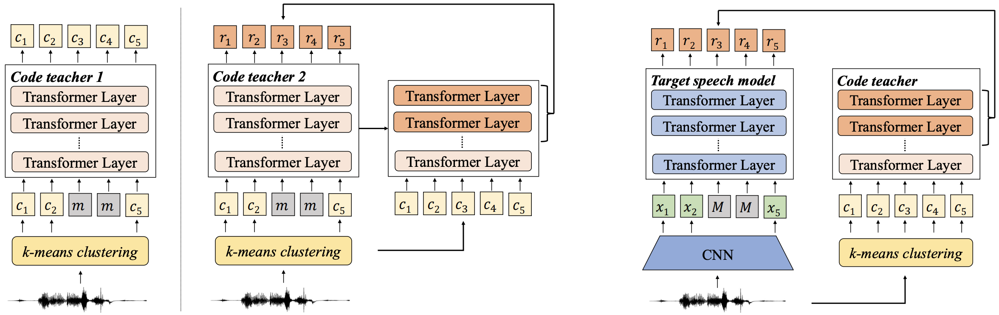

# CoBERT

> [**CoBERT: Self-Supervised Speech Representation Learning Through Code Representation Learning**](https://arxiv.org/abs/2210.04062)

## Introduction
**Co**de **BERT** (CoBERT) is an approach for self-supervised speech representation learning.
The idea is to convert an utterance to a sequence of discrete codes, and perform code representation learning.
CoBERT outperforms the most recent state-of-the-art performance on the ASR task and brings significant improvements on the SUPERB speech translation (ST) task.



## Pre-Trained Models
Model | Pretraining Data | Model
|---|---|---
code teacher 1 | [Librispeech](http://www.openslr.org/12) 960 hr | [download](https://drive.google.com/file/d/1IwLJU7WWyFpjyeuFvl3P7KKbt-_C6Yzw/view?usp=sharing)
code teacher 2 | [Librispeech](http://www.openslr.org/12) 960 hr | [download](https://drive.google.com/file/d/1bo0qBEIiuEQYObPe_0cVYnJES-vG59cX/view?usp=share_link)
CoBERT base | [Librispeech](http://www.openslr.org/12) 960 hr | [download](https://drive.google.com/file/d/1omdxrzU14Q8K28tmcvvRABQMRvc7Uk2h/view?usp=share_link)

## Extract features using pre-trained models
```python
import torch
import torch.nn.functional as F
from cobert.models.cobert_with_teacher import CobertWithTeacherConfig, CobertWithTeacherModel

checkpoint = torch.load("path/to/checkpoint.pt")
cfg = CobertWithTeacherConfig(**checkpoint["cfg"]["model"])
model = CobertWithTeacherModel.build_model(cfg)

# code teacher is useless in this case. remove them.
model.code_teacher_model = None
for k in list(checkpoint["model"].keys()):
    if "code_teacher_model" in k:
        del checkpoint["model"][k]

# also delete ema
del checkpoint["model"]["_ema"]
model.load_state_dict(checkpoint["model"])
model.eval()

wav_input_16khz = torch.randn(1,10000)
normalize = checkpoint["cfg"]["task"]["normalize"]  # True by default
if normalize:
    wav_input_16khz = F.layer_norm(wav_input_16khz[0], wav_input_16khz[0].shape).unsqueeze(0)

# extract representations for each layer
layer_results = model.extract_features(source=wav_input_16khz, padding_mask=None)["layer_results"]
# T x B x C -> B x T x C
layer_results = [l[2].transpose(0, 1) for l in layer_results]
```
## Implementation
### Setup
Please follow the instructions below to clone the code and install the python environment for CoBERT.
```
git clone https://github.com/mct10/CoBERT.git
cd CoBERT
git submodule update --init fairseq
pip install --editable fairseq/
cd fairseq
python setup.py build develop
cd ..
```

### Data Preparation
We follow the steps for prepare the manifest in [here](https://github.com/facebookresearch/fairseq/tree/main/examples/data2vec#prepare-training-data-manifest) and HuBERT label in [here](https://github.com/facebookresearch/fairseq/tree/main/examples/hubert/simple_kmeans).

### code teacher 1
- Pre-training
```
fairseq-hydra-train -m \
    --config-dir cobert/config/code_teacher_1/pretraining \
    --config-name base_librispeech \
    task.data=/path/to/manifest \
    task.label_dir=/path/to/codes \
    model.label_rate=50 \
    dataset.valid_subset=dev_other \
    dataset.train_subset=train \
    common.user_dir=/path/to/CoBERT/cobert/
```
- Fine-tuning
```
fairseq-hydra-train -m \
  --config-dir cobert/config/code_teacher_1/finetuning \
  --config-name base_100h \
  task.data=/path/to/manifest \
  task.label_dir=/path/to/label \
  +task.code_dir=/path/to/codes \
  model.w2v_path=/path/to/ckpt \
  common.user_dir=/path/to/CoBERT/cobert/
```
- Inference
```
python cobert/infer.py \
  --config-dir cobert/config/code_teacher_1/decode \
  --config-name infer_viterbi \
  task.data=/path/to/manifest \
  task.normalize=false \
  +task.code_dir=/path/to/codes \
  common_eval.path=/path/to/ckpt \
  dataset.gen_subset=dev_other \
  common.user_dir=/path/to/CoBERT/cobert/
```

### code teacher 2
- Pre-training
```
fairseq-hydra-train -m \
    --config-dir cobert/config/code_teacher_2/pretraining \
    --config-name base_librispeech \
    task.data=/path/to/manifest \
    dataset.valid_subset=dev_other \
    dataset.train_subset=train \
    +model.no_sin_pos_embed=true \
    common.user_dir=/path/to/CoBERT/cobert/
```
- Fine-tuning
```
fairseq-hydra-train \
    --config-dir cobert/config/code_teacher_2/finetuning \
    --config-name base_100h \
    task.data=/path/to/manifest \
    task.label_dir=/path/to/label \
    model.w2v_path=/path/to/ckpt \
    dataset.train_subset=train_100h \
    dataset.valid_subset=dev_other \
    common.user_dir=/path/to/CoBERT/cobert/
```
- Inference

```
python cobert/infer.py \
  --config-dir cobert/config/code_teacher_2/decode \
  --config-name infer_viterbi \
  task.data=/path/to/manifest \
  task.normalize=false \
  task.label_dir=/path/to/label \
  common_eval.path=/path/to/ckpt \
  dataset.gen_subset=dev_other \
  common.user_dir=/path/to/CoBERT/cobert/
```

### CoBERT
- Pre-training
```
fairseq-hydra-train \
    --config-dir fairseq/examples/wav2vec/config/finetuning \
    --config-name base_100h \
    task.data=/path/to/manifest \
    model.w2v_path=/path/to/ckpt \
    +model.normalize=true \
    dataset.train_subset=train_100h \
    dataset.valid_subset=dev_other \
    common.user_dir=/path/to/CoBERT/cobert/
```
- Fine-tuning
```
fairseq-hydra-train -m \
    --config-dir cobert/config/cobert/pretraining \
    --config-name base_librispeech \
    task.data=/path/to/manifest \
    dataset.valid_subset=dev_other \
    dataset.train_subset=train \
    model.code_teacher_ckpt=/path/to/teacher \
    model.code_teacher_type=code_teacher_2 \
    +model.multi_outputs=true \
    common.user_dir=/users/cmeng9/CoBERT/cobert/
```
- Inference
```
python cobert/infer.py \
  --config-dir fairseq/examples/speech_recognition/new/conf \
  --config-name infer \
  task=audio_finetuning \
  task.labels=ltr \
  decoding.type=viterbi \
  task.data=/path/to/manifest \
  task.normalize=true \
  common_eval.path=/path/to/ckpt \
  dataset.gen_subset=dev_other \
  common.user_dir=/path/to/CoBERT/cobert/
```
## Citation
If you find our work is useful in your research, please cite the following paper:
```bibtex
@article{meng2022cobert,
  title   = {CoBERT: Self-Supervised Speech Representation Learning Through Code Representation Learning},
  author  = {Meng, Chutong and Ao, Junyi and Ko, Tom and Wang, Mingxuan and Li, Haizhou},
  eprint={2210.04062},
  archivePrefix={arXiv},
  primaryClass={cs.SD},
  year={2022}
}
```
